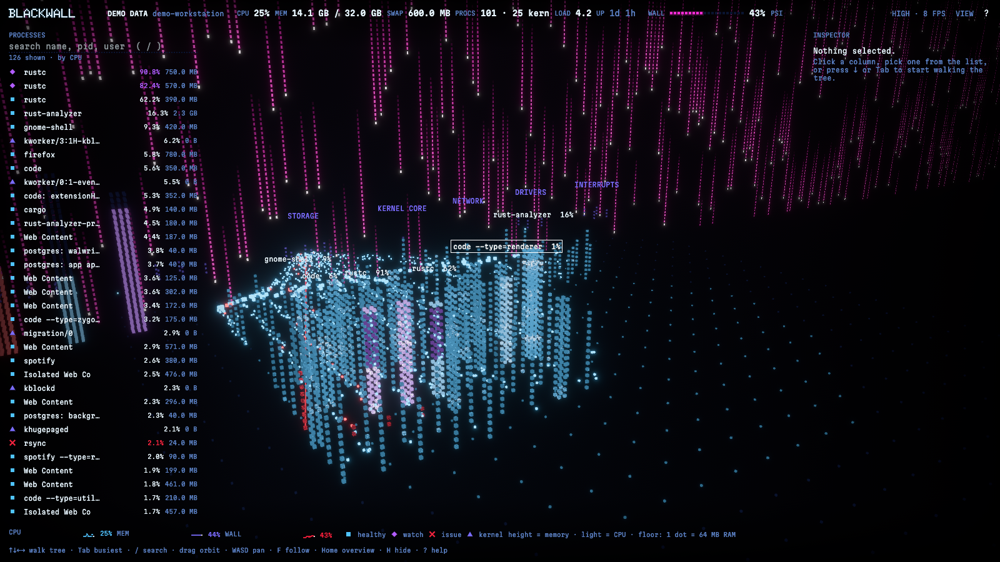
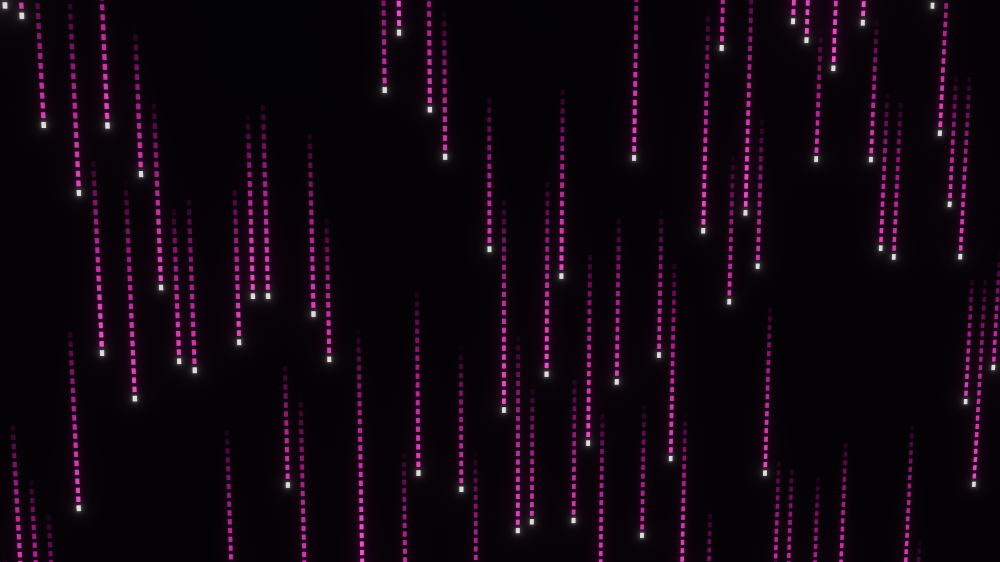
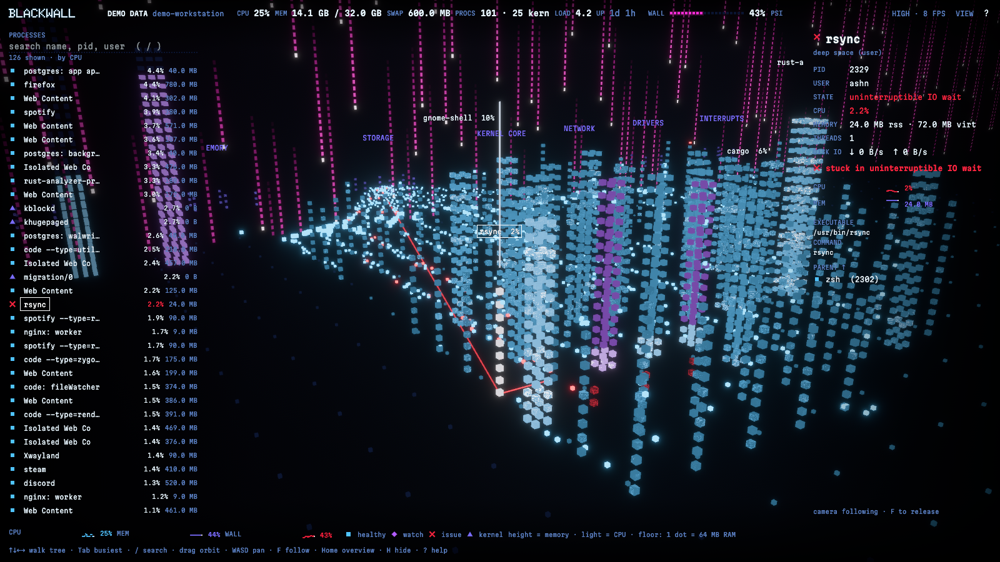

# Blackwall

A cyberpunk system visualizer modelled on the Blackwall chamber in Cyberpunk 2077, entered the way you'd fall into the Matrix. Every process is a **column of light** in a city standing on a floor that is the machine's RAM. Behind it hangs the **Blackwall**, the kernel/user boundary, as a curtain of falling magenta rain, with the kernel's threads on its far side. Use it as ambient art, or drill into any column for real diagnostics.

Native Rust (Bevy + egui) for **Linux, Windows and macOS**. No paid code-signing certificates required (see [docs/PLAN.md](docs/PLAN.md) §3.7). The visual language is defined in the Blackwall design system (Claude Design); `crates/bw-scene/src/palette.rs` mirrors its colors.

> Status: early development, Milestones 0–1 (foundation + Deep Space). See the full [plan](docs/PLAN.md).



## What you're looking at

**Black is nothing; light is data.** Every pixel that doesn't stand for something is pure black. **Color means health and nothing else**, so red always means "look here".

| | |
|---|---|
| **Column** | One process. Taller and denser (1×1 up to 3×3 dots) = more memory |
| **Brightness, rising pulses** | CPU usage; the busiest dots burn to a white core |
| **Ice blue / violet / red** | Healthy / worth watching (saturating a core) / issue (zombie, stuck in IO wait, stopped; blinks) |
| **Districts** | Each process tree is a block of columns, families side by side |
| **Floor** | RAM: one dot per 64 MB (more on big machines), lit from the city outward as memory fills |
| **The Blackwall** | Falling rain of magenta dots with white-hot heads. Under **kernel pressure** (Linux PSI, estimated elsewhere) it thickens, speeds up, burns red and tears |
| **Behind the Wall** | Kernel threads as indigo columns, in districts per subsystem |
| **Streams of dots** | Disk IO flowing through the Wall to storage; CPU work flowing to the scheduler. Red streams come from processes with issues |
| **Tall 3×3 columns at the left** | Volumes: lit dots = used space |
| **Exits** | A process that exits dissolves upward into the dark |

Opening Blackwall falls through the rain into the chamber while the city resolves out of black (any key skips it; `--no-intro` turns it off).





## Run

```sh
cargo run --release -p blackwall             # this machine
cargo run --release -p blackwall -- --demo   # a synthetic workstation (labelled DEMO DATA)
```

Options: `--quality low|medium|high|ultra` (default: automatic), `--interval-ms N`, `--size WxH`, `--select NAME`, `--hide-ui`, `--no-intro`, `--screenshot out.png --after SECONDS`.

### Linux build dependencies

```sh
sudo apt install libasound2-dev libudev-dev libwayland-dev libxkbcommon-dev   # Debian/Ubuntu, to build
sudo apt install libxkbcommon-x11-0                                          # to run under X11
```

No extra dependencies on Windows or macOS.

## Controls

Everything works from the keyboard; touch and mouse are optional.

| Key | Action |
|---|---|
| ↑ / ↓ / ← / → | Parent / child / previous sibling / next sibling |
| Tab | Cycle the busiest processes |
| `/` or Ctrl/⌘+K | Search |
| Enter / I, L, H | Inspector, process list, hide the whole HUD |
| Drag, Shift+arrows | Orbit |
| Right-drag, WASD | Pan |
| Wheel, PgUp/PgDn | Zoom |
| Pinch / two-finger drag | Zoom / pan on touchscreens |
| F, Home | Follow selection, overview |
| 1–5 | All family lines, kernel side, streams, labels, issues-only (dims everything healthy) |
| M | Reduced motion |
| ? | Shortcut sheet |

## Workspace

| Crate | Role |
|---|---|
| `bw-model` | Platform- and engine-free data model: snapshots, deltas, capabilities |
| `bw-platform` | Per-OS probes behind one `Collector` trait (the only crate allowed `cfg(target_os)`) |
| `bw-source` | Live and demo sources (replay and remote come later) |
| `bw-scene` | Bevy scene: city layout, dot mesh + shaders, the Wall, streams, picking, camera, quality tiers |
| `bw-ui` | egui HUD |
| `blackwall` | The app |

## License

MIT OR Apache-2.0 (proposed; see plan §16).
