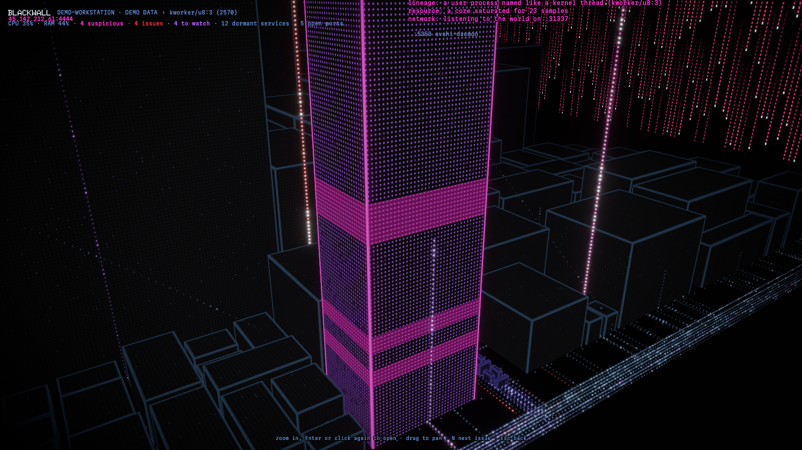

# Blackwall

A cyberpunk system visualizer: a map of your machine you can read at a glance and get lost in. The ground is your **RAM**: every process, kernel and user alike, stands on a plot as large as the memory it holds, and free memory is open, empty ground. On each plot rises a dark tower, tall when the process is busy. Round the whole map runs the **Blackwall**, your firewall, as a wall of falling magenta rain with a gate for every open port. Outside the city, a district of ghosts stands for the services you defined but haven't run in months. Anything suspicious burns magenta.

Native Rust (Bevy + egui) for **Linux, Windows and macOS** (process internals, ports and system units are Linux-only so far; containers and project folders work everywhere). No paid code-signing certificates required (see [docs/PLAN.md](docs/PLAN.md) §3.7).

> Status: early prototype. See the full [plan](docs/PLAN.md).


The line under the title is the verdict: what the system is doing and what needs attention (`CPU 36% · RAM 44% · 4 suspicious · 4 issues · 12 dormant services · 5 open ports`).

## Reading the map

| What | Shows |
|---|---|
| **Plot area** | Resident memory. Each plot holds one block per 128 MB, so a big process is a crowded cluster you can count. The kernel's own memory (caches, slabs) is a heavy violet slab; free memory is empty ground |
| **Tower height** | Recent CPU, in proportion to the plot: an idle process is a squat block, a busy one a tower |
| **Material** | User processes are near-black walls of data cells; kernel threads a denser, heavier material in courses. Hover or choose a tower and its cells come up: it is made of data, and the lit share is its CPU |
| **Color** | Health (blue healthy, violet worth watching, red an issue) and, in the Wall's magenta, **suspicion** |
| **Beacons** | Every process with an issue or a suspicion sends a beam into the sky, visible from anywhere |
| **The Blackwall** | The firewall. Each listening port is a gate: open (allowed), barred (blocked), magenta (rules not read yet: press F, the OS asks for admin rights), or a small door at the foot (local only) |
| **Arcs** | Connections, from their tower over the Wall to the far address out in the dark |
| **Cables and conduits** | Parent to child; disk IO to the volumes |
| **Ghosts** | Dormant services: systemd units you added, containers, project folders (a compose file, a Procfile, a start script), autostart entries, cron jobs. The longer idle, the taller; failed ones red |

**Suspicion** is about whether something is what it claims to be, kept apart from health:

| Family | Flags |
|---|---|
| Network | Listening to the world on an unusual port; talking to a public address on an unusual port |
| Lineage | Running from /tmp or a deleted file; a user process named like a kernel thread; a shell or downloader spawned by a server or browser |
| Resource | A core saturated for a minute by something that isn't a compiler; memory that only ever climbs |
| Persistence | Autostart entries, units and scheduled jobs added this week; scheduled commands that download and run code |



## Zooming in

There are no modes: the map, a tower and the inside of a process are zoom levels. Choose a tower and zoom into it, and its walls fall away to an outline. In its place stands the process: a monolith of memory slabs (one per region, each with its own window pattern), threads as slabs cantilevered out of it (how far out, and how many windows are lit, is CPU), descriptors as pipes (files drop to storage, sockets climb into the dark). Anything between you and what you chose becomes an outline, so the city never blocks the view.


**Anomalies** are what you hunt inside: a thread stuck in IO wait or a zombie (red, blinking), a thread spinning above 90% (violet), a memory region that grew in each of the last few samples, a descriptor count that keeps climbing. Each raises a beacon; chevrons at the screen's edge point at the ones out of view.


## Run

```sh
cargo run --release -p blackwall             # this machine
cargo run --release -p blackwall -- --demo   # a synthetic workstation (labelled DEMO DATA)
```

Options: `--quality low|medium|high|ultra` (default: automatic), `--interval-ms N`, `--size WxH`, `--select NAME`, `--dive NAME [--find]`, `--firewall` (read the firewall's rules at start), `--hide-ui`, `--no-intro`, `--screenshot out.png --after SECONDS`.

Firewall rules come from `firewall-cmd` (no admin rights needed), or `ufw`/`nft` through `pkexec` when you press F.

### Linux build dependencies

```sh
sudo apt install libasound2-dev libudev-dev libwayland-dev libxkbcommon-dev   # Debian/Ubuntu, to build
sudo apt install libxkbcommon-x11-0                                          # to run under X11
```

No extra dependencies on Windows or macOS.

## Controls

| Input | Action |
|---|---|
| Drag · WASD · arrows | Pan the map |
| Wheel · pinch · +/− | Zoom toward the cursor (the view tilts from map to street level) |
| Right-drag · Q / E | Turn; right-drag up/down tilts |
| Click | Choose a tower, gate, ghost or address |
| Zoom in · Enter · click again | Open the chosen tower |
| Zoom out · Esc | Close it, then clear the choice |
| ↑↓ / ←→ inside | Floors and slabs / pipes |
| N | Next suspicious process or issue; inside: next anomaly |
| Tab | The busiest processes in turn |
| F | Read the firewall's rules (may ask for admin rights) |
| Home | The whole map |
| `/` or Ctrl/⌘+K | Search |
| I, L, V, H | Inspector, process list, machine vitals, hide all text |
| 1–5, M | Family cables, kernel, IO conduits and connections, labels, issues only; reduced motion |
| ? | Shortcut sheet |

## Workspace

| Crate | Role |
|---|---|
| `bw-model` | Platform- and engine-free data model: snapshots, deltas, ports, connections, the firewall, services |
| `bw-platform` | Per-OS probes behind one `Collector` trait: processes, process internals, sockets and firewall rules from `/proc` and the firewall tools, the service sweep (the only crate allowed `cfg(target_os)`) |
| `bw-source` | Live and demo sources; a slow side thread sweeps services every minute and reads the firewall on request |
| `bw-scene` | Bevy scene: the RAM treemap, solid towers, the Blackwall and its gates, ghosts, suspicion rules, process interiors and anomalies, semantic-zoom camera, picking, quality tiers |
| `bw-ui` | The quiet HUD: breadcrumb, verdict, whispers, anomaly compass, summoned panels and search |
| `blackwall` | The app |

## License

MIT OR Apache-2.0 (proposed; see plan §16).
