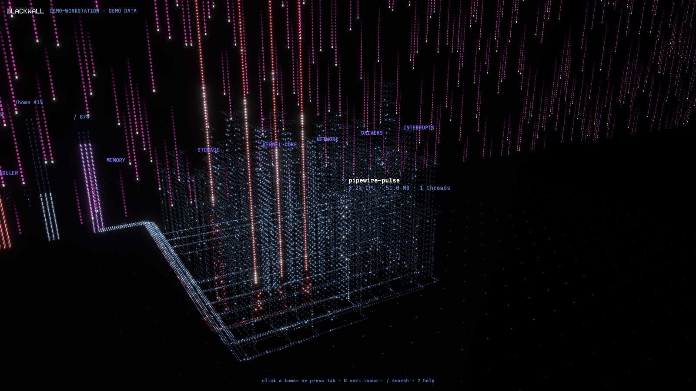
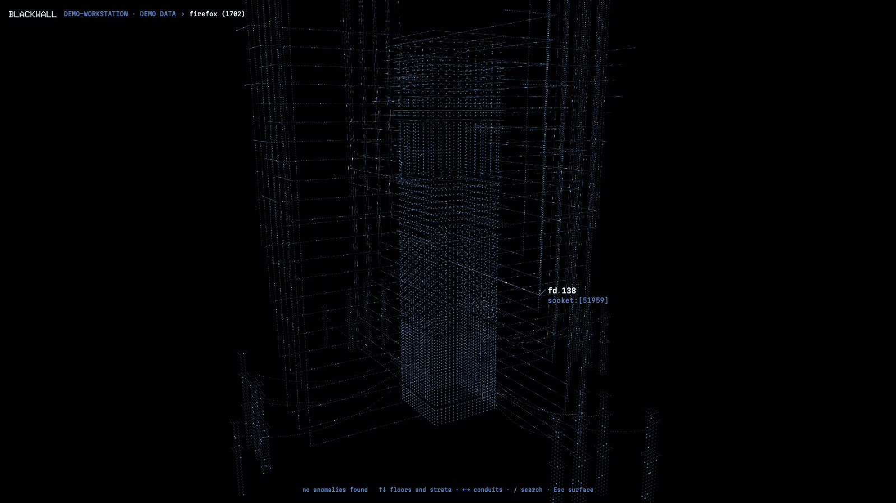
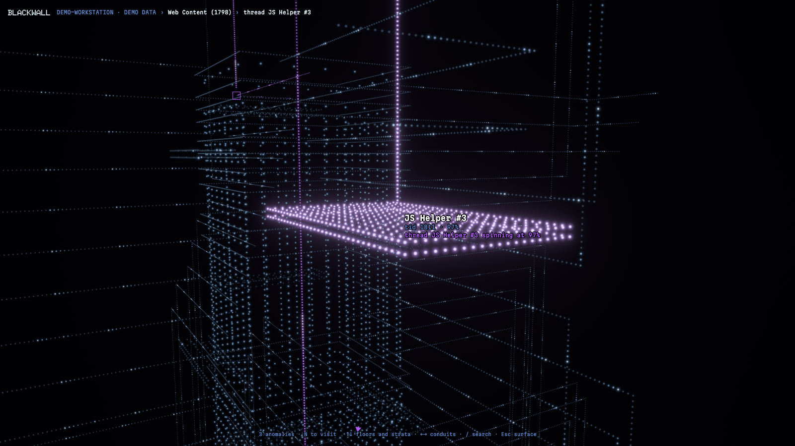

# Blackwall

A cyberpunk system visualizer: a second world you explore to find what's wrong with your machine. Every process is a brutalist tower of dim windows, crowded in among the others in the dark in front of the **Blackwall**, the kernel/user boundary, which hangs behind the city as falling magenta rain. Choose a tower and you stand at its foot looking up; dive in and the city falls away. Inside is the process itself: a monolith of memory slabs, its threads as slabs cantilevered out of it, its open files and sockets as pipes leading out into the dark, and its children as towers crowded round it. Somewhere in there is the small thing that's wrong.

Native Rust (Bevy + egui) for **Linux, Windows and macOS** (process internals are Linux-only so far). No paid code-signing certificates required (see [docs/PLAN.md](docs/PLAN.md) §3.7). Colors come from the Blackwall design system (Claude Design), mirrored in `crates/bw-scene/src/palette.rs`.

> Status: early prototype. See the full [plan](docs/PLAN.md).



## Three levels

| Level | What you see | How you move |
|---|---|---|
| **The machine** | Process towers, crowded together. Height is memory, with a ledge (and a step in) at 10 MB, 100 MB and 1 GB; width is threads; the share of lit windows is CPU; color is health. Cables join parents to children, conduits carry disk IO to storage, and every process with an issue raises a beacon you can see from anywhere. The RAM floor, the rain Wall, kernel threads behind it | Click a tower, Tab through the busiest, or N through the ones with issues: the camera flies to its foot |
| **Inside a process** | A monolith of memory slabs (one per region: code, libraries, heap, anonymous, files, stacks, each with its own window pattern, height by size), threads as cantilevered slabs (how far out they reach, and how many windows are lit, is CPU), descriptors as pipes (files fall to storage, sockets climb into the dark), children as towers crowded round. Anomalies raise beacons | Enter or click the chosen tower again to dive; Esc to surface |
| **An element** | One floor, stratum, conduit or satellite, up close | ↑↓ floors and strata, ←→ conduits and satellites, N the next anomaly, Enter on a satellite to dive into that child |



**Anomalies** are what you hunt: a thread stuck in IO wait or a zombie (red, blinking), a thread spinning above 90% (violet), a memory region that grew in each of the last few samples, a descriptor count that keeps climbing. Chevrons at the edge of the screen point at anomalies you can't see yet.



**Color means health and nothing else**: ice blue healthy, violet worth watching, red an issue. Black is nothing; light is data. The HUD stays out of the way: a breadcrumb, a whisper beside whatever you're looking at, and a single hint line. Everything else is summoned.

Opening Blackwall falls through the rain into the chamber (any key skips it; `--no-intro` turns it off).

## Run

```sh
cargo run --release -p blackwall             # this machine
cargo run --release -p blackwall -- --demo   # a synthetic workstation (labelled DEMO DATA)
```

Options: `--quality low|medium|high|ultra` (default: automatic), `--interval-ms N`, `--size WxH`, `--select NAME`, `--dive NAME [--find]`, `--hide-ui`, `--no-intro`, `--screenshot out.png --after SECONDS`.

### Linux build dependencies

```sh
sudo apt install libasound2-dev libudev-dev libwayland-dev libxkbcommon-dev   # Debian/Ubuntu, to build
sudo apt install libxkbcommon-x11-0                                          # to run under X11
```

No extra dependencies on Windows or macOS.

## Controls

Everything works from the keyboard; touch and mouse are optional. There is no free flight: you move by choosing.

| Key | Action |
|---|---|
| Click, Tab, ↑↓←→ | Choose a tower (Tab: busiest; arrows: walk the process tree) |
| N | Next tower with an issue; inside: next anomaly |
| Enter, or click the chosen tower again | Dive in (on a satellite: dive into that child) |
| Esc | Back out one level |
| ↑↓ / ←→ inside | Floors and strata / conduits and satellites |
| `/` or Ctrl/⌘+K | Search (inside: the process's threads, libraries, files and sockets) |
| I, L, V | Summon the inspector, the process list, the machine vitals |
| H | Hide all text |
| Drag, Shift+arrows, wheel, pinch | Look around and zoom at the current spot |
| Home | Back to the overview |
| 1–5, M | Family cables, kernel side, IO conduits, labels, issues only; reduced motion |
| ? | Shortcut sheet |

## Workspace

| Crate | Role |
|---|---|
| `bw-model` | Platform- and engine-free data model: snapshots, deltas, capabilities |
| `bw-platform` | Per-OS probes behind one `Collector` trait, including process internals from `/proc` on Linux (the only crate allowed `cfg(target_os)`) |
| `bw-source` | Live and demo sources (replay and remote come later) |
| `bw-scene` | Bevy scene: city layout, process interiors and anomaly detection, guided exploration, dot mesh + shaders, the Wall, picking, camera, quality tiers |
| `bw-ui` | The quiet HUD: breadcrumb, whispers, anomaly compass, summoned panels and search |
| `blackwall` | The app |

## License

MIT OR Apache-2.0 (proposed; see plan §16).
